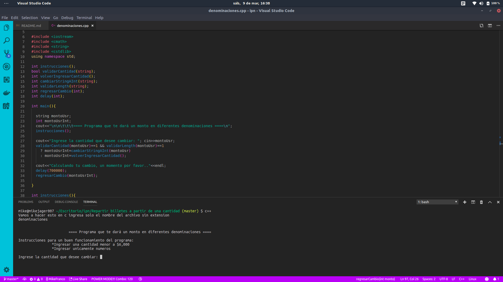

<h1>Nombre del Alumno:</h1>
<h3>Miguel Angel Franco Peza</h3>

<h1>Materia:</h1>
<h3>Fundamentos de Programación Orientada a Objetos</h3>

<h1>Fecha:</h1>
<h3>20 de Febrero del 2019</h3>

<h1>Secuencia:</h1>
<h3>2NM22</h3>

<h1>Número de Trabajo</h1>
<h3>Programa número 4</h3>

<h1>Requerimiento:</h1>
<h3>Realizar un código que muestre qué tipo de triángulo es según los lados ingresados</h3>

<h1>Pantalla preliminar</h1>

<pre>           ===Programa que dice tu tipo de triángulo según sus lados==

  Instrucciones para un buen funcionamiento del programa:
      *Ingresar un numero menor a 10 digitos
      *Ingresar únicamente números

  Ingrese el lado 1:

  Ingrese el lado 2:

  Ingrese el lado 3:
</pre>
<h1>Tabla de Pruebas</h1>

| Valores de prueba  | Salida esperada              |
| -------------      |:------------------------:    |
|          | |
|          | |
|          | |
|          |

<h1>Pantalla con el código funcionando</h1>

<h1>Nombre del Tester:</h1>
<h3>Cuautle González Kiara</h3>