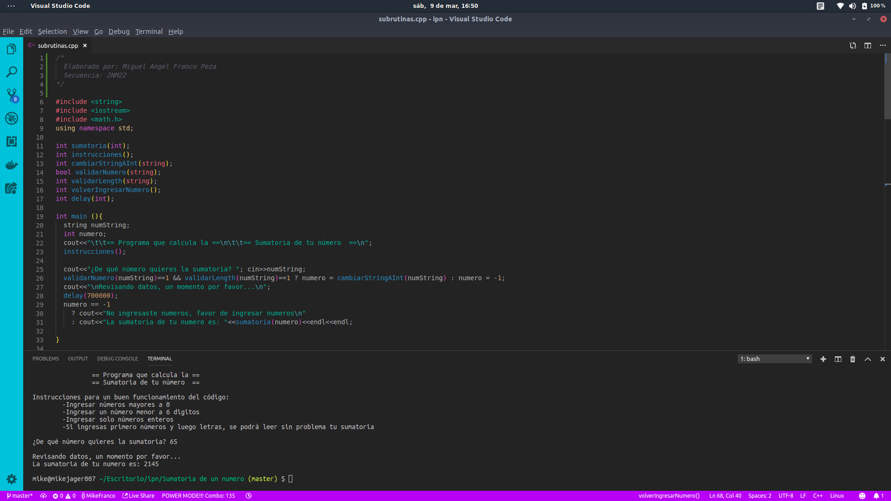

<h1>Nombre del Alumno:</h1>
<h3>Miguel Angel Franco Peza</h3>

<h1>Materia:</h1>
<h3>Fundamentos de Programación Orientada a Objetos</h3>

<h1>Fecha:</h1>
<h3>20 de Febrero del 2019</h3>

<h1>Secuencia:</h1>
<h3>2NM22</h3>

<h1>Número de Trabajo</h1>
<h3>Programa número 6</h3>

<h1>Requerimiento:</h1>
<h3>Hacer un programa que reparta un monto en diferentes denominaciones: 500,100, 50,10,5,1</h3>
<h3>El monto lo dará el usuario y máximo será de $6,000

<h1>Pantalla preliminar</h1>

<pre>
                                  == Programa que calcula la ==
                                  == Sumatoria de tu número  ==

  Instrucciones para un buen funcionamiento del programa:
      -Ingresar número mayores a 0
      -Ingresar un número menor a 6 dígitos
      -Ingresar solo números enteros
      -SI ingresas primero números y luego letras, se podrá leer sin problema la sumatoria

  ¿De qué numero quieres la sumatoria? 

  Revisando los datos, un momento por favor...
  La sumatoria de tu número es: 
</pre>
<h1>Tabla de Pruebas</h1>

| Valores de prueba  | Salida esperada                  |
| -------------      |:------------------------:        |
|  45                |   1035                           |
|  hola              |  No ingresaste números, favor de ingresar números     |
|  8994              |  40450515                                             |
|  -99               |   Se pide al usuario volver a ingresar el dato         |

<h1>Pantalla con el código funcionando</h1>

<h1>Nombre del Tester:</h1>
<h3>Cuautle González Kiara</h3>